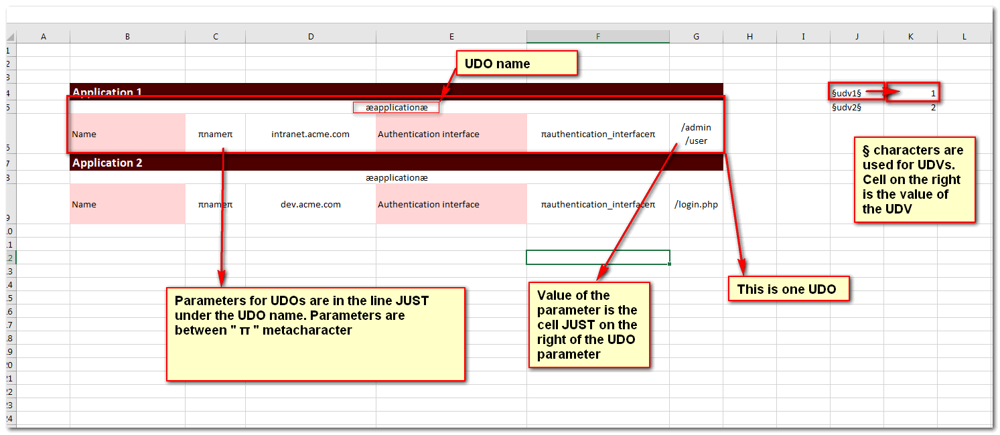
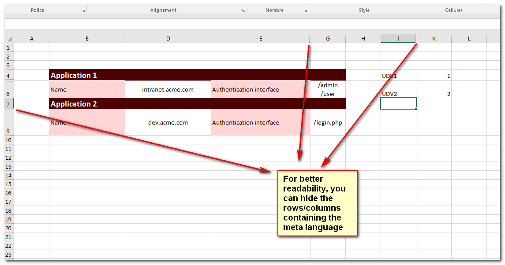
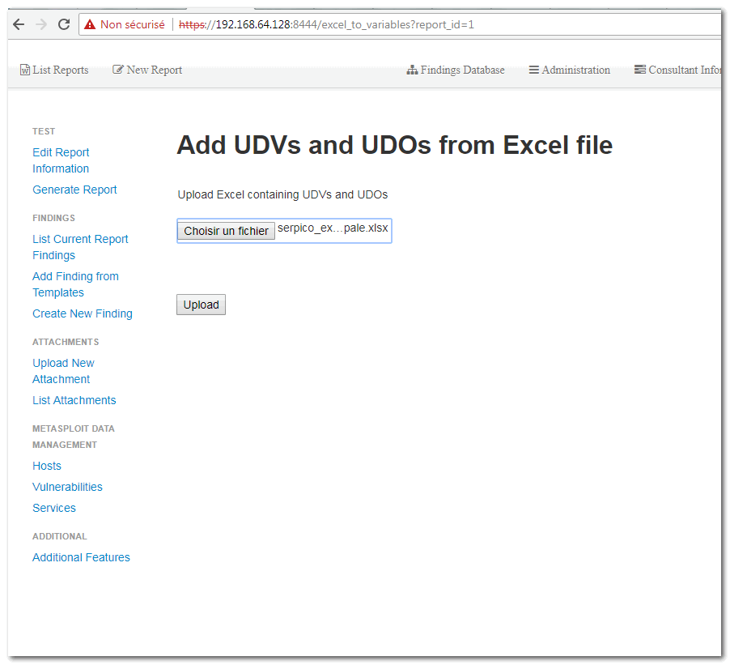
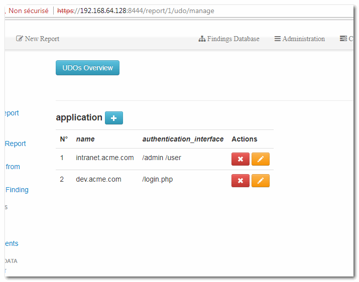
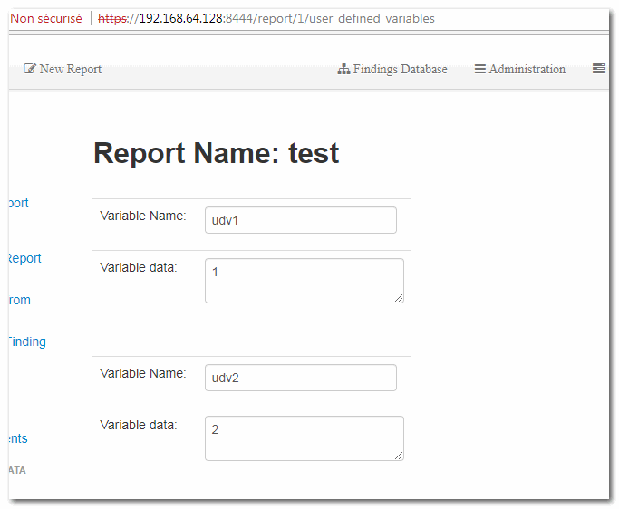

# What's this
With this module, you can create UDVs and UDOs from an excel file. This is especially usefull if you wan't to use formula to automatically calculate UDVs, or things like that.

# How

## Here's an exemple of Excel containing UDOs and UDVs

## Upload your Excel

## The UDOs and UDVs are created

